# Praktikum
<b>1. Text Widget</b>  
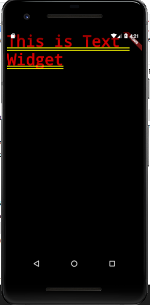
 <b>2. Image Widget</b>  
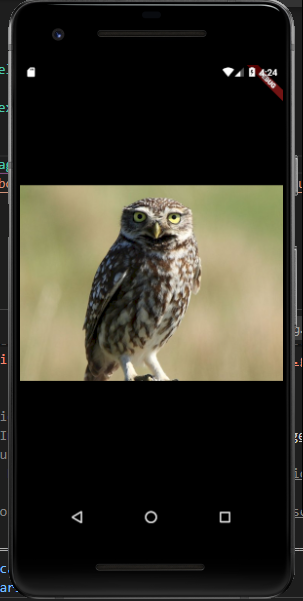
 <b>3. Material Design dan iOS Cupertino</b>  
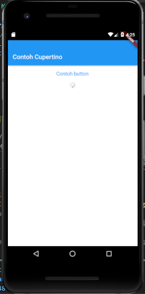
 <b>4. Button</b>  
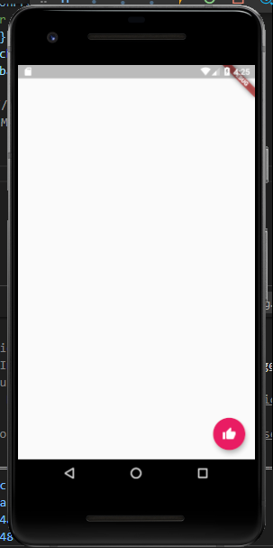
 <b>5. Scaffold</b>  
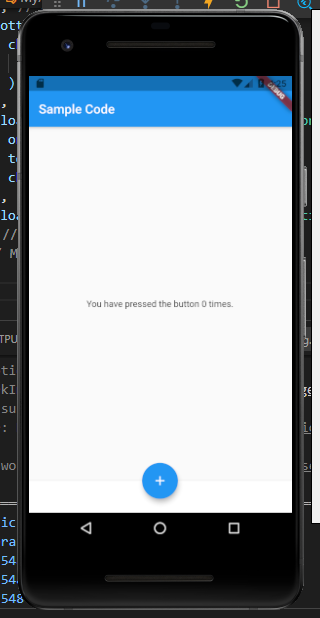
 <b>6. Dialog</b>  
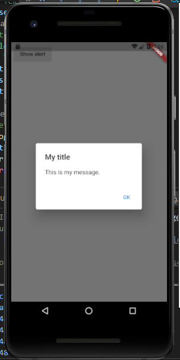
 <b>7. Input dan Selection Widget</b>  
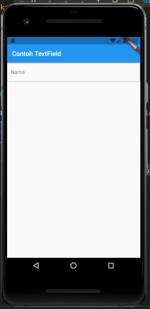
 <b>8. Date and Time Pickers</b>  
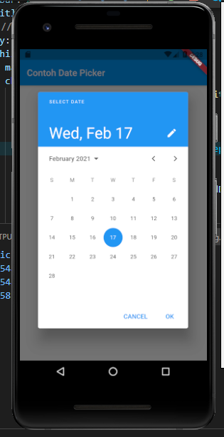
 <b>9. Container</b>  
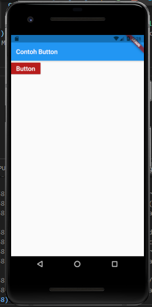
 <b>10. Aligment</b>  
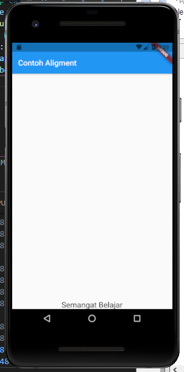
 <b>11. Color pada Container</b>  
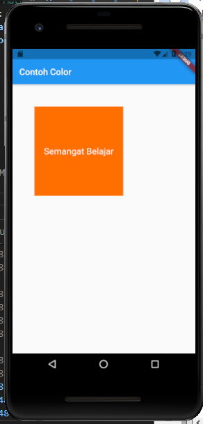
 <b>12. Height dan Width</b>  
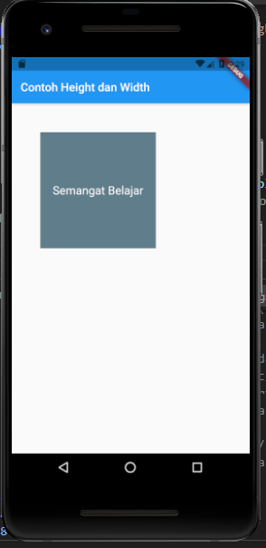
 <b>13. Margin</b>  
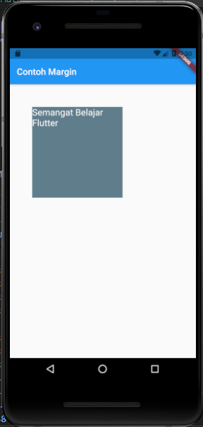
 <b>14. Padding</b>  
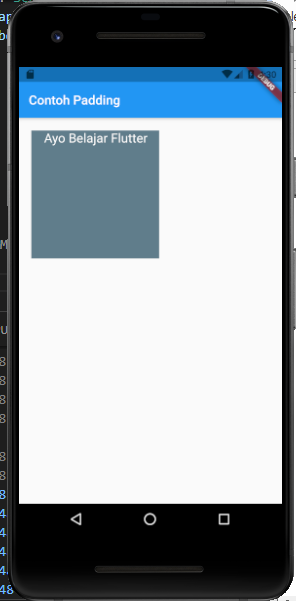
 <b>15. Transform</b>  
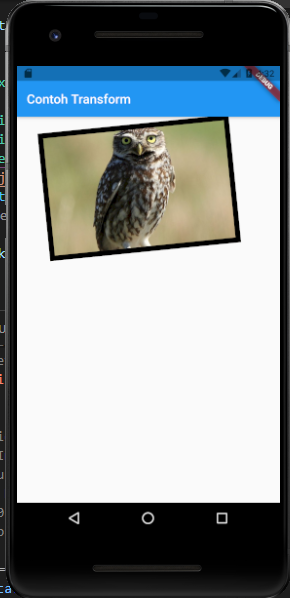
 <b>16. Decoration</b>  
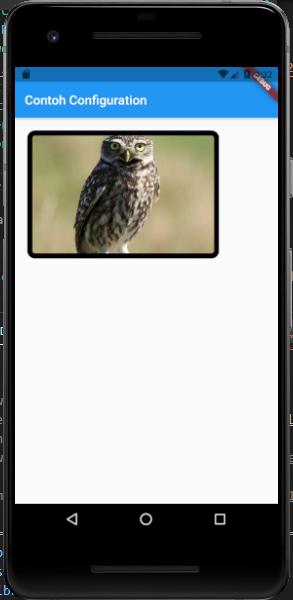
 <b>17. Column</b>  
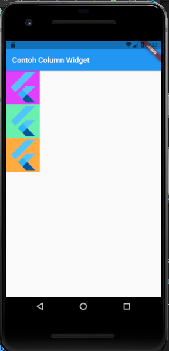
 <b>18. Row</b>  
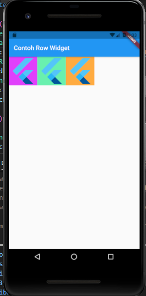
 <b>19. Stack</b>  
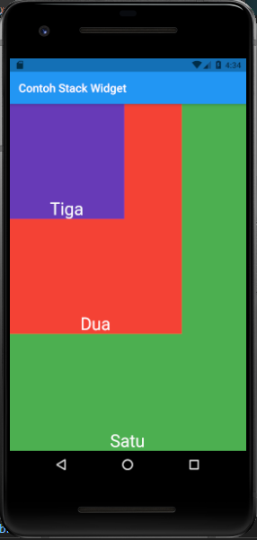
 <b>20. ListView</b>  
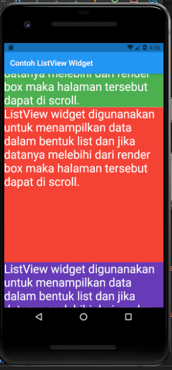
 <b>21. GridView</b>  
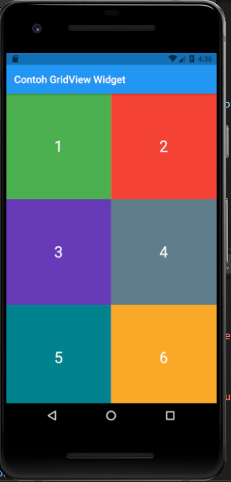

# Tugas

 <b>Tugas Berita Sepak Bola</b>  
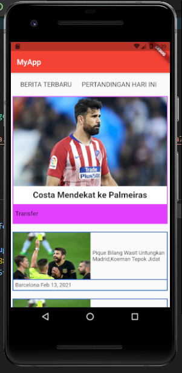

## Getting Started

This project is a starting point for a Flutter application.

A few resources to get you started if this is your first Flutter project:

- [Lab: Write your first Flutter app](https://flutter.dev/docs/get-started/codelab)
- [Cookbook: Useful Flutter samples](https://flutter.dev/docs/cookbook)

For help getting started with Flutter, view our
[online documentation](https://flutter.dev/docs), which offers tutorials,
samples, guidance on mobile development, and a full API reference.
